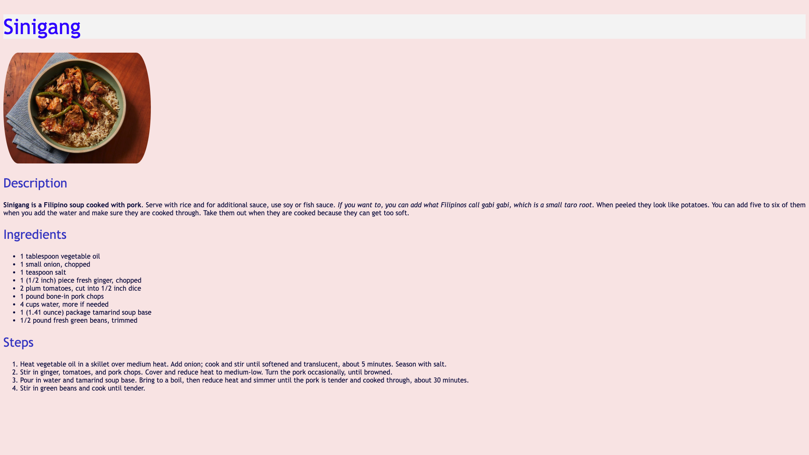
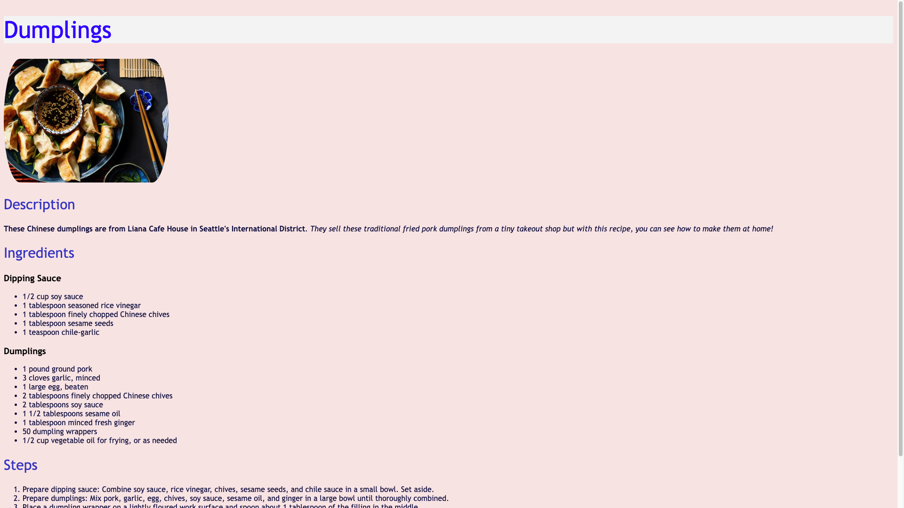
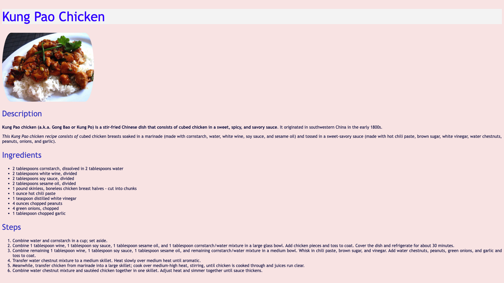

# odin-recipes
A Basic Recipe Website ([live demo](https://moitorgh.github.io/odin-recipes/))

## Table of Contents
* [General Info](#general-info)
* [Technologies](#technologies)
* [Screen Grabs](#screen-grabs)
* [Project Status](#project-status)
* [Setup & Usage](#setup--usage)
* [Self Reflections](#self-reflections)
* [Feature Additions](#feature-additions)
* [Contact & Support](#contact--support)
* [Acknowledgements](#acknowledgements)

## General Info
* **odin-recipes** is the [first project](https://www.theodinproject.com/lessons/foundations-recipes) of the [Foundations course](https://www.theodinproject.com/paths/foundations/courses/foundations) in [The Odin Project](https://www.theodinproject.com/about).
* It is a basic recipe website that consists of a main index page which has links to three recipes.

## Technologies
  * **Git**
  * **GitHub**
  * **GitHub Pages**
  * **HTML**
  * **CSS**

## Screen Grabs

## Project Status
***This project is no longer actively maintained***.

* I will not be improving all the other recipe webpages to resemble the look and feel of the index page.
* This is mainly because of two reasons that relate to The Odin Project:
  * Firstly, [it is important to focus on the task at hand and keep moving through the curriculum](https://dev.to/theodinproject/learning-code-f56).
  * Secondly, [projects in the foundations course aren't a strong portfolio generator](https://dev.to/theodinproject/strategically-building-your-portfolio-1km4).

## Setup & Usage
* Fork and `git clone` the **odin-recipes** repository to get a local copy.
* Either view the [live demo](https://moitorgh.github.io/odin-recipes/) or open `index.html` in your favorite browser.

## Self Reflections
* This is the first project in the Foundations course of The Odin Project.
* I practiced my basic HTML chops which included stuff like the HTML boilerplate (i.e., the DOCTYPE and the elements html, head, meta, title, body etc.) along with other elements and documentations for headings, paragraphs, bold and italicized, nesting and indentation, ordered and unordered lists, links and images, git commit messages, writing READMEs, and build and deployment using github-pages.
* I also added CSS to change the look and style of the website. Some of the techniques that I utilized were the usage of a universal selector, type selectors, class selectors, ID selectors, grouping selectors, chaining selectors, descendant combinator, several CSS properties (particular the use of web fonts and generic fonts), CSS cascade, specificity, inheritance, and rule order.
* Furthermore, I improved upon the previous CSS by utilizing the newly learned CSS box model. I also used a gif to make it look pleasant and completely revamped the index page from earlier iterations.

## Feature Additions
- [x] ~~Style it up with CSS~~
- [x] ~~Improve index page using CSS box model~~
- [ ] Improve all webpages using CSS box model
- [x] ~~Give sources in the acknowledgements section~~
- [x] ~~Write a comprehensive and well documented README~~

## Contact & Support
* Feel free to contact me on **discord (moitorgh_26401)**.
* No further improvements will be made for this project.

## Acknowledgements
* The project specifications are in the [first project](https://www.theodinproject.com/lessons/foundations-recipes) of the [Foundations course](https://www.theodinproject.com/paths/foundations/courses/foundations) in [The Odin Project](https://www.theodinproject.com/about).
* This README is inspired by [ritaly's README-cheatsheet](https://github.com/ritaly/README-cheatsheet) and [ArjunSaili1's README advice](https://github.com/TheOdinProject/curriculum/discussions/25472#discussioncomment-5889343).
